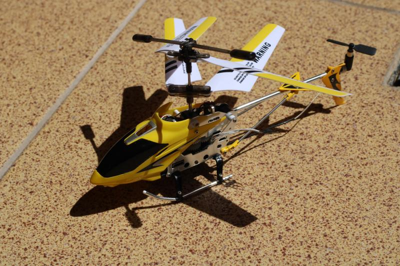

## Syma S107 Bluetooth mod

Syma S107 is a toy helicopter model being popular in early-2010s. It's rather well known because of its low cost, good flying characteristics and sturdy body resistant to crashes.

The original remote control system uses infrared communication - similar to how classic TV remotes work. The major drawback of such solution is that it's very sensitive to direct sunlight - making it very hard (and even slightly dangerous) to fly this toy outside. This also requires keeping a dedicated remote which is larger than this toy and always tend to go missing :)

This is a complete redesign of original motherboard, featuring Bluetooth LE with broader range and smartphone compatibility, battery charger with USB port and battery level reporting, additional outputs and custom, hackable firmware!

