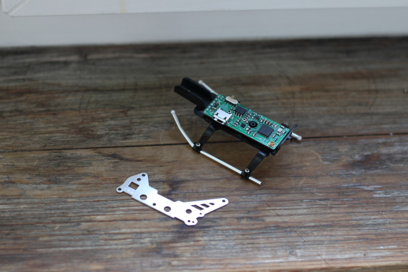

## Syma S107 Bluetooth mod (PCB repo)

(Also see [this repo](https://github.com/dossalab/Syma-s107-bluetooth-mod-firmware) for the source code)

This repo contains PCB for Syma S107x Bluetooth LE mod. The idea is to completely redesign the original board, switching from clunky infra-red remote control to modern, better supported Bluetooth solution.

(this is a photo of an older revision):

